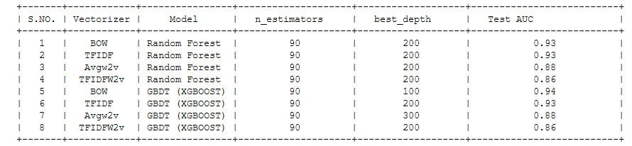

# Sentiment Analysis of Amazon Fine Food Reviews using classical machine learning models

Amazon Fine Food Reviews Analysis Data Source: https://www.kaggle.com/snap/amazon-fine-food-reviews

The Amazon Fine Food Reviews dataset consists of reviews of fine foods from Amazon.

Number of reviews: 568,454 Number of users: 256,059 Number of products: 74,258 Timespan: Oct 1999 - Oct 2012 Number of Attributes/Columns in data: 10

#### Input :
    Reviews text and Reviews Score.

#### Output :
    ROC AUC of various machine learning models.


## Requirements

- sklearn libraries
- each ipynb contains all the necessary imports kindly check each ipynb


  
## Run Locally

Clone the project

```bash
  git clone https://link-to-project
```

Go to the project directory

```bash
  cd my-project
```

Install dependencies

```bash
  install above packages
```

Run main file

```bash
  Run each file in jupyter notebook
```

  
## Conclusion
                      KNN (K Nearest Neighbor)


                      LR (Logistic regression)


                      MNB (Multinomial Naive Bayes)


                      SVM (Support Vector Machine)


                      DT (Decision Tree)


             RFGBDT(Random Forest and Gradient Boosting)

  
## Authors

- [@shubendu](https://www.github.com/shubendu)

  
## Acknowledgements

 - [Applied AI](https://www.appliedaicourse.com/)


  